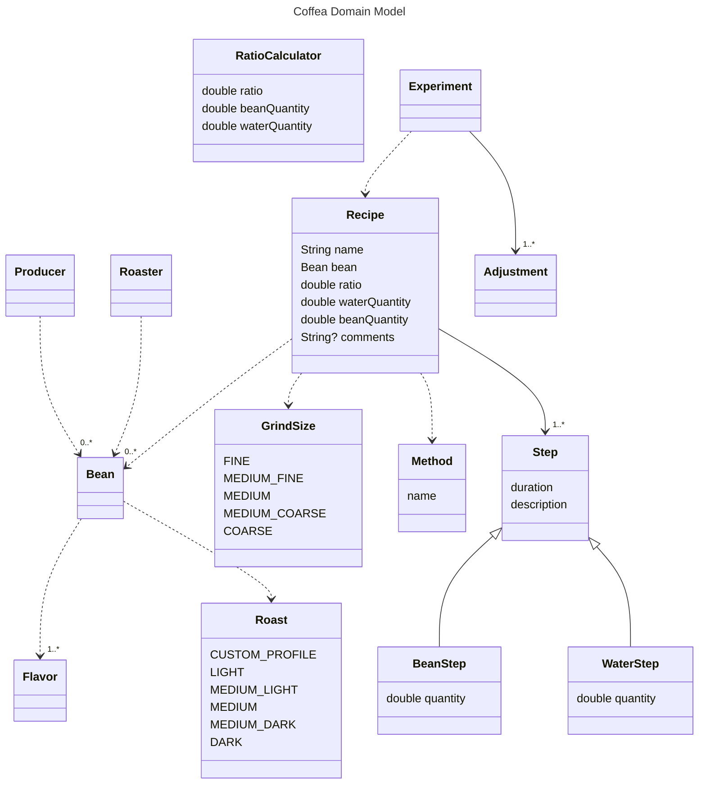

```mermaid
---
title: Coffea Domain Model
---

classDiagram
    class Bean

    class RatioCalculator {
        double ratio
        double beanQuantity
        double waterQuantity
    }

    class Flavor

    class Method {
        name
    }

    class GrindSize {
        FINE
        MEDIUM_FINE
        MEDIUM
        MEDIUM_COARSE
        COARSE
    }

    class Producer

    class Roaster

    class Roast {
        CUSTOM_PROFILE
        LIGHT
        MEDIUM_LIGHT
        MEDIUM
        MEDIUM_DARK
        DARK
    }

    class Recipe {
        String name
        Bean bean
        double ratio
        double waterQuantity
        double beanQuantity
        String? comments
    }

    class Step {
        duration
        description
    }

    class WaterStep {
        double quantity
    }

    class BeanStep {
        double quantity
    }

    class Experiment

    Bean ..> "1..*" Flavor
    Bean ..> Roast
    Experiment ..> Recipe
    Experiment --> "1..*" Adjustment
    Producer ..> "0..*" Bean
    Recipe ..> Bean
    Recipe ..> GrindSize
    Recipe ..> Method
    Recipe --> "1..*" Step
    Roaster ..> "0..*" Bean
    Step <|-- BeanStep
    Step <|-- WaterStep
``` 
